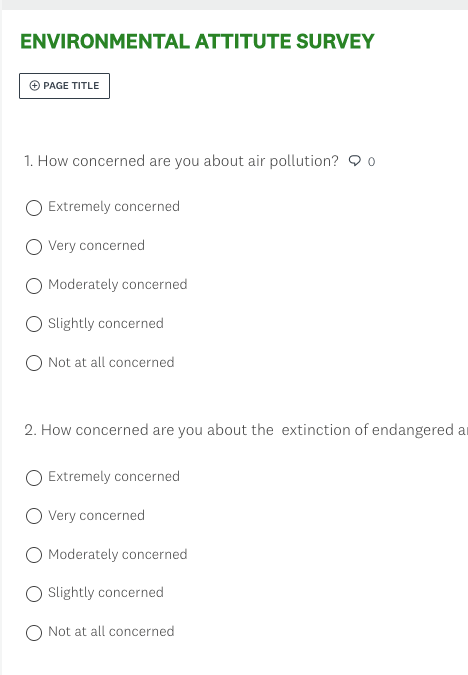
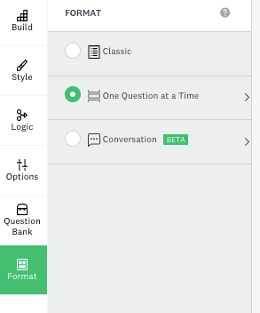
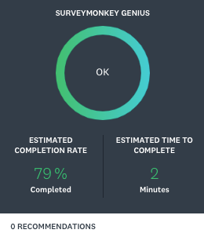

# Activity 1 - Creating Basic Multiple-Choice Surveys

1.	For this activity, make sure to login in on SurveyMonkey using your UVic credentials using the link [here](https://www.uvic.ca/systems/support/web/surveymonkey/index.php){:target="_blank"}
    - Alternatively, you can use the free version of SurveyMonkey by using an email and creating a password. However, the free version may have some limitations whereas the UVic subscription is a complete one.
2. Once you are logged in you will see the following page and on the top right a box that reads ‘CREATE SURVEY”.
    
3.	Go to the left pane and click on ‘START FROM SCRATCH” as in the picture below:
    
4.	 The box below will pop up, name your survey as **“ENVIRONMENTAL ATTITUDE SURVEY”**, for category you can choose “OTHER” and click on “USE MY OWN CONTACTS”.
    

5.	Click on **"CREATE A SURVEY"**:
    

6.	Now you have created the workspace for your survey. Please take a moment to visualize and explore your SurveyMonkey workspace. 

    - On the top ribbon you will see the stages of your survey from “SUMMARY TO PRESENT RESULTS”. 
    - In the left pane you will see that there are icons with option for your survey building process such as “BUILD”, “STYLE”, etc. 
    - In the middle of your workspace, there are also two “QUESTION BANKS” with pre-designed survey questions. On the main area you will see the title of your survey and a green button to design a NEW QUESTION.
    
7.	Now that you are more familiar with the SurveyMonkey workspace, let’s start building up our survey about environmental attitudes.
 Click on the green button on the right lower corner that reads “NEW QUESTION” and type in Q1 (question 1) “How concerned are you about air pollution?” and enter some answers as the following and finish this question by saving it: 
    - _Tip! Make sure that multiple-choice option is enabled in the box on the right side of the question, as you can see there are many types of questions we can have, but today we are focusing on Multiple-choice._
    - As you type in you will see this on your screen, don’t forget to save it by clicking on the **Save** button at the end of the page.
    - Once you save your first survey question, it will look like this:
    
    - Note that there are some boxes for you to edit your question and answers, apply logic to it, copy the question or delete it. Feel free to either explore it or to move to the next step.

    

8.	Let’s move on and add another question by clicking in the green box “NEW QUESTION”
    - Type in question 2 as below:

    ```
    Q2. How concerned are you about 
    the extinction of endangered animals?

    o	Extremely concerned
    o	Very concerned 
    o	Moderately concerned 
    o	Slightly concerned
    o	Not at all concerned
    ```

    

    - Click **SAVE**.  Your survey should look like the following image:
    
    

    

9. Proceed and click the **TRIANGLE** next to the button **+NEXT QUESTION** 
    - you can combine different type of questions within one survey. For example, you can have a survey with multiple-choice questions, image choice, comment box, among others! Today we will focus on Multiple-choices only, but you are welcome to explore any options you may want.

10.	Now let’s complete our multiple-choice question survey by adding more questions to it. You can either follow the questions bellow or you can write your own question. Feel free to also explore other types of questions you may be interested in this hands-on part!

 ```
 Q3. The term global warming is often used to refer to the idea that the world’s 
 average temperature may be about 5 degrees Fahrenheit higher in 75 years 
 than it is now. Do you think global warming is good or bad?
 o	Extremely concerned
 o	Very concerned 
 o	Moderately concerned 
 o	Slightly concerned
 o	Not at all concerned

 Q4. Do you believe that society is spending too much time trying to reduce global warming, too little time, 
 or about the right amount of time?
 o	Much too much
 o	Somehow too much
 o	Slightly too much
 o	Slightly too little
 o	Somewhat too little
 o	Much too little
 o	About the right amount

 Q5. Is reducing global warming more important than improving the economy, 
 less important than improving the economy, 
 or about as important as improving the economy?
 o	Much more important
 o	Somewhat more important
 o   About as important
 o   Less important

 Q6. When people get involved in trying to solve environmental problems, 
 how often do you think they make things better?
 o	Always
 o	Most of the time
 o	About half the time
 o	Once in a while
 o	Never

 Q7. How well do you think the environment can recover on its own 
 from problems caused by humans?
 o	Extremely well
 o	Very well
 o	Somewhat well
 o	Not so well
 o	Not at all well

 Q8. Which of the following alternative energy sources do you think will be MOST 
 important in the next 10 years?

 o	Wind
 o	Solar
 o	Nuclear
 o	Ethanol
 o	Natural gas
 o	Coal
 Other (Please Specify)
 ```

 - _Tip: Note that for the question above you have an open ending option, to add that type it down in the end of the question where it says “ADD AN “OTHER” ANWER OPTION OR COMMENT FIELD” as the following image:_

 

 ```
 Q9. Should the universities create more projects or less projects to support 
 alternative energy??

 o	Much more projects
 o	Somewhat more projects
 o	Slightly more projects
 o	About the same amount of projects
 o	Slightly less projects
 o	Somewhat less projects
 o	Much less projects 

 Q10. How often do you recycle?

 o	Always
 o	Most of the time
 o	About half the time
 o	Once in a while
 o	Never

 Q11. How willing are you to change your lifestyle to reduce the damage you may cause 
 to the environment?

 o	Extremely willing
 o	Very willing
 o	Somewhat willing
 o	Not so willing
 o	Not at all willing

 Q12. How likely are you to buy a more expensive product if its packaging is more 
 environmentally-friendly than its competitor’s product?

 o	Extremely likely
 o	Very likely
 o	Moderately likely
 o	Slightly likely
 o	Not at all likely
 ```

 

11. Now that our questions are complete we can format our survey. It is a great time to use our creativity and think strategically about having a survey that engages the audience beyond the survey questions. We can add color to the survey, add a logo, a footer, the layout, fronts, and we can also choose different themes for the survey.  Click on the icon “STYLE” on the left column and modify the style of your survey by adding colors, changing the font, adding a image as a logo from your choosing and so on.
    
12.	Choosing the FORMAT of your survey. This means that you can set how the questions will show up to the audience: 1) as a classic survey all in a page, 2) One question at time; 3) As a conversation (similar to a digital chat). Let’s try one question at time, this is a great way to get people worry-free about the length of the survey.
    
    - Next to the option “ONE QUESTION AT A TIME” you can click on the arrow > and customize the button to pass from one question to another. You can, for instance, choose “OK”, “NEXT QUESTION”, “NEXT”, etc. 

    
    
     
13.	Now let’s go to the top ribbon and explore the option ‘PREVIEW & SCORE”. In this section we can have a view of how our survey will look like on different types of screens using **DEVICE VIEW**.  
    - SurveyMonkey automatically shows you the estimated completion rate of the process of your survey so far, the estimated time for someone to complete it, and any recommendations that the system may have. 

     
    
     

    - **_TIP: THIS IS ALSO A GREAT MOMENT TO DOUBLE CHECK THE SURVEY TO MAKE SURE IT IS AS GOOD AS YOU WOULD LIKE._**

14.	On the top of the page click “NEXT” and you can see some options to collect your response, today, we are choosing to “SEND SURVEYS YOUR WAY”.

     

    

15.	The following image will pop up, and you have many options to spread your survey out. Take a moment on the option, and once you. Have read them out, choose “SHARE A SURVEY LINK”.
     
     

16.	A page with a link should have pop “WE LINK 1”, you can copy your survey link and spread it out! Alternatively, you can also customize the link to make it reflect your survey/project.

     
    
    - To customize the link, simply click on the button “CUSTOMIZE” on the right side of your web link and change the name after the /. Then click on “SAVE”. I for example, chose to call my survey ENVIRONMENTSURVEY.

     

17.	Now we are all set up to collect answers, copy the link and share with five people in this workshop, and make sure to also respond the survey link that your colleagues will send to you. Please be aware that anyone with your survey link will be able to answer it. 

    - This step will take 2-3 minutes. Below you can see my link, but you need to copy your own weblink. Feel free to respond it as well.

    [https://www.surveymonkey.ca/r/ENVIRONMENTSURVEY](https://www.surveymonkey.ca/r/ENVIRONMENTSURVEY){:target="_blank"}


[NEXT STEP: Analyzing Results](2-Analyzing Results.html){: .btn .btn-blue }