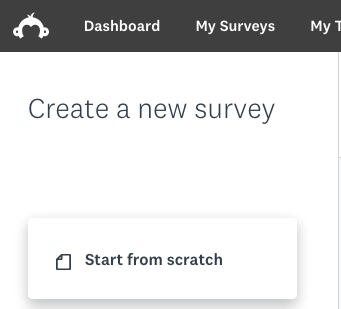
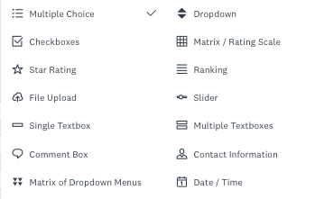
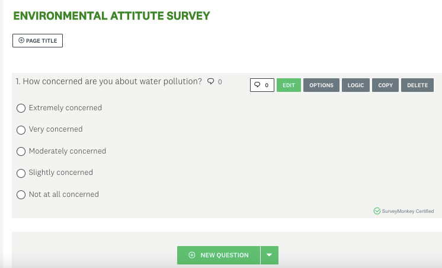
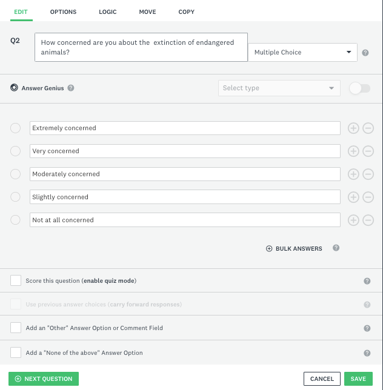

# Activity 1 - Creating Basic Multiple-Choice Surveys

1.	For this activity, make sure to login in on SurveyMonkey using your UVic credentials using the link [here](https://www.uvic.ca/systems/support/web/surveymonkey/index.php){:target="_blank"}
    Alternatively, you can use the [free version of SurveyMonkey](https://www.surveymonkey.com/){:target="_blank"} by using an email address. However, the free version may have some limitations whereas the UVic subscription is a complete one.
  	
2.	Once you are logged in, you will see the following page and on the top right a box that reads **CREATE SURVEY**.
    
3.	Click on the buttom **CREATE SURVEY**, and then click on **START FROM SCRATCH** as in the picture below:
<br>

4.	 Click on the top, where it says "Untitled", and then the box below will appear. Change the name of your survey to <code>ENVIRONMENTAL ATTITUDE SURVEY</code>, and then click on "Save".
    
<!-- still need to update this animation -->
<!--    <button onclick="toggle('gif1')">Show/Hide Animation</button> -->
<!--    <div id="gif1"> -->
<!--     -->
<!--   </div> -->

5.	Now you have created the workspace for your survey. Please take a moment to visualize and explore your SurveyMonkey workspace. 

   - On the top ribbon, you will see the stages of your survey from “SUMMARY" to "ANALYZE RESULTS”. 
   - Below the top ribbon, you will see that there are icons with options for your survey building process, such as “BUILD”, “STYLE”, etc.
   - On the left pane, you will see a different menu depending on the survey building process you choose. For example, if you choose "STYLE", you will see options to choose the settings and themes of your survey style.
   - In the main area, you will see the title of your survey and a gray box to design a NEW QUESTION.
   
   

6.	Now that you are more familiar with the SurveyMonkey workspace, let’s start building up our survey about environmental attitudes.
  
   In the gray box, type in Q1 (question 1) <code>How concerned are you about air pollution?</code> and enter the answers below and finish this question by saving it:

   ```
   How concerned are you about air pollution?
   o	Extremely concerned
   o	Very concerned 
   o	Moderately concerned 
   o	Slightly concerned
   o	Not at all concerned
   ```
  
   - _Tip! Make sure that the multiple-choice option is enabled in the box on the right side of the question. As you can see, there are many types of questions we can have, but today we are focusing on Multiple-choice._
     
     
   - As you type in you will see the image below on your screen. Don’t forget to save it by clicking on the **SAVE** button at the end of the page.
   
   
    
   Once you save your first survey question, it will look like this:
    
   
    
   - Note that there are some boxes for you to edit your question and answers, apply logic to it, copy the question or delete it. Feel free to either explore it or move to the next step.
    
   

7.	Let’s move on and add another question by clicking in the green box **Add Content**, and then clicking on "Question".
   - Type in question 2 as below:
   ```
   How concerned are you about the extinction of endangered animals?
   o	Extremely concerned
   o	Very concerned 
   o	Moderately concerned 
   o	Slightly concerned
   o	Not at all concerned
   ```

   
    
   - Again, don't forget to make sure the question type selected is "Multiple choice". However, know that you can combine different types of questions within one survey. For example, you can have a survey with multiple-choice questions, image choice, comment box, among others! Today, we will focus on multiple-choice only, but you are welcome to explore any options you may want.

   - Click **SAVE**.  Your survey should look like the following image:
    
   

<!-- still need to update this animation -->
<!--    <button onclick="toggle('gif2')">Show/Hide Animation</button> -->
<!--    <div id="gif2"> -->
<!--     -->
<!--    </div> -->

8. Now let’s complete our multiple-choice question survey by adding more questions to it. You can either copy and paste the questions below or you can write your own questions. Feel free to also explore other types of questions beyond multiple-choice.

   To copy and paste questions, Survey Monkey has a really useful tool that allows you to copy and paste questions in text format, and it will automatically format your questions into Survey Monkey, choosing what it considers to be the most appropriate question type.

   For that, click on the **Add Content** green button, and then select "Copy and paste questions".
   
   

   A pop-up window will appear. Copy and paste the questions below into the text box on the left.

```
The term global warming is often used to refer to the idea that the world’s average temperature may be about 5 degrees Fahrenheit higher in 75 years than it is now. Knowing this definition how concerned are you about global warming?
 o	Extremely concerned
 o	Very concerned 
 o	Moderately concerned 
 o	Slightly concerned
 o	Not at all concerned

Do you believe that society is spending too much time trying to reduce global warming, too little time,  or about the right amount of time?
 o	Much too much
 o	Somehow too much
 o	Slightly too much
 o	Slightly too little
 o	Somewhat too little
 o	Much too little
 o	About the right amount

Is reducing global warming more important than improving the economy, less important than improving the economy, or about as important as improving the economy?
 o	Much more important
 o	Somewhat more important
 o  About as important 
 o  Less important 

When people get involved in trying to solve environmental problems, how often do you think they make things better?
 o	Always
 o	Most of the time
 o	About half the time
 o	Once in a while
 o	Never

How well do you think the environment can recover on its own from problems caused by humans?
 o	Extremely well
 o	Very well
 o	Somewhat well
 o	Not so well
 o	Not at all well

Which of the following alternative energy sources do you think will be MOST important in the next 10 years?
 o	Wind
 o	Solar
 o	Nuclear
 o	Ethanol
 o	Natural gas
 o	Coal
 Other (Please Specify)

Should the universities create more projects or less projects to support alternative energy?
 o	Much more projects
 o	Somewhat more projects
 o	Slightly more projects
 o	About the same amount of projects
 o	Slightly less projects
 o	Somewhat less projects
 o	Much less projects 

 How often do you recycle?
 o	Always
 o	Most of the time
 o	About half the time
 o	Once in a while
 o	Never

How willing are you to change your lifestyle to reduce the damage you may cause to the environment?
 o	Extremely willing
 o	Very willing
 o	Somewhat willing
 o	Not so willing
 o	Not at all willing

How likely are you to buy a more expensive product if its packaging is more environmentally-friendly than its competitor’s product?
 o	Extremely likely
 o	Very likely
 o	Moderately likely
 o	Slightly likely
 o	Not at all likely
```


Then click on "Add 10 questions". You will see that Survey Monkey will automatically identify the questions and options for the multiple-choice question format. If it made a mistake, you can then edit the questions to fix it, by hovering over the question and clicking on the green "Edit" button.

- _For example: Note that for question 8, you have an open-ended option, but Survey Monkey did not identify that. To correct that, click on "Edit", and then delete the " Other (Please Specify)" from the multiple choice list, and type it down at the end of the question where it says **Add an “Other” Answer Option or Comment Field**:_

 

 <script>  

    function toggle(input) {
        var x = document.getElementById(input);
        if (x.style.display === "none") {
            x.style.display = "block";
        } else {
            x.style.display = "none";
        }
    }
</script>

[NEXT STEP: Survey Formatting](2-survey-format.html){: .btn .btn-blue }
