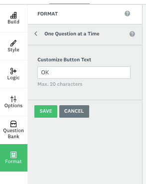
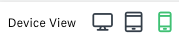
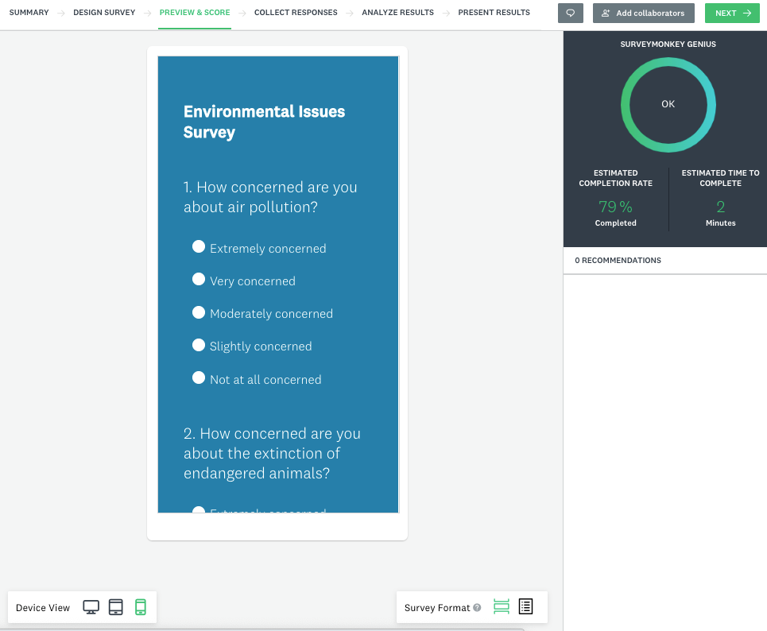
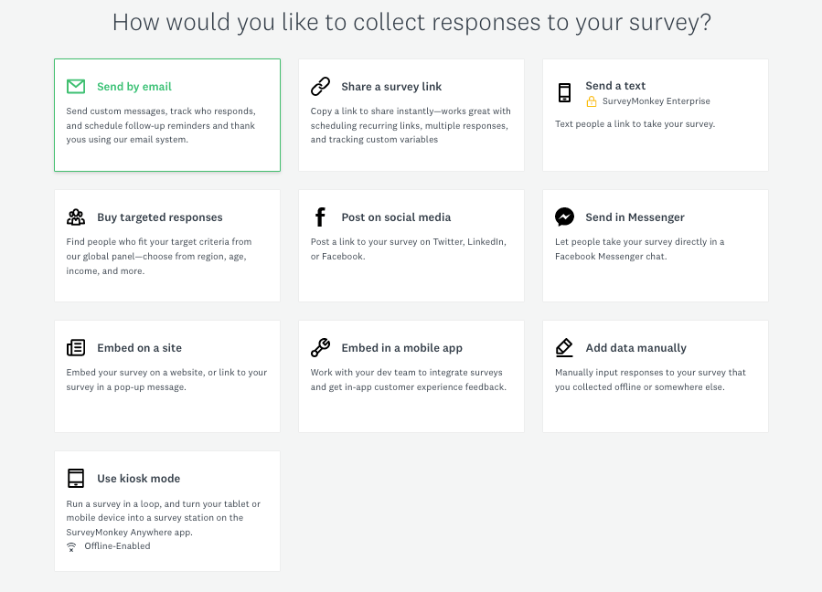

# Activity 2 - Survey Formatting

1. Now that our questions are complete, we can format our survey. It is a great time to use our creativity and think strategically about having a survey that engages the audience beyond the survey questions.

   We can add color to the survey, add a logo, a footer, the layout, fronts, and we can also choose different themes for the survey.  Click on the icon **STYLE** on the top left and modify the style of your survey by adding colors, changing the font, adding a image as a logo from your choosing and so on.
<!--- need to update this animation --->
<!--- <button onclick="toggle('gif1')">Show/Hide Animation</button> --->
<!--- 
 --->
<!---  --->
<!--- 
 --->
    
2.	Choosing the FORMAT of your survey. This means that you can set how the questions will show up to the audience:
   1) as a classic survey all in a page,
   2) One question at time,
   3) As a conversation (similar to a digital chat).
   Click on the **Format** button on the top right, and then select **One Question at a Time**. This is a great way to get people worry-free about the length of the survey.

   

   - Next to the option “ONE QUESTION AT A TIME”, you can click on the **arrow >** and customize the button to pass from one question to another. You can, for instance, replace “OK” by typing in “Next question”, “Next”, etc.

   
       
   
3.	Now let’s go to the top ribbon and explore the option **Preview Survey**. This will open a new tab, where you can have a view of how your survey will look on different types of screens using the device view options at the bottom right of the page.
   
   For example, if you choose to preview the phone option, this is what you would see in this preview window:
     

   - SurveyMonkey automatically shows you the estimated completion rate of the process of your survey so far, the estimated time for someone to complete it, and any recommendations that the system may have. 

   - **_TIP: This is also a great moment to double-check the survey to make sure it is as good as you would like._**

   Close the preview tab once you are happy with your survey.

4.	Once your survey is set up, it is time to collect responses. On the top ribbon of the page, click on **COLLECT RESPONSES**.
5.	You will be sent to the following image, where the link for your survey will be shown. Moreover, you will have many other options to spread your survey out. Take a moment to read through the options. You could choose more than one way to share your survey, and each selection you make will create a new "collector" item in Survey Monkey.

     
   
   For now, let's use the link. Since the link is already shown, click on "Copy" if you want to copy the link. Alternatively, if you want to edit the link for a custom URL, you can click on settings and then "customize":
    
   
    
If this were a research project, you'd send this link to invite people to participate in your survey! 

<!--- need to update animation --->    
<!---     <button onclick="toggle('gif2')">Show/Hide Animation</button> --->
<!---     
 --->
<!---      --->
<!---     
 --->

6.	Now we are all set up to collect answers! Copy the link and share it with five people in this workshop, and make sure to also respond to the survey link that your colleagues will send to you. Please be aware that anyone with your survey link will be able to answer it. 

    - This step will take 2-3 minutes. **Below you can see my link, but you need to copy your own weblink.** Feel free to respond to it as well.
    [https://www.surveymonkey.ca/r/dsc-environmentsurvey](https://www.surveymonkey.ca/r/dsc-environmentsurvey){:target="_blank"}

 

[NEXT STEP: Analyzing Results](3-analyzing-results.html){: .btn .btn-blue }
