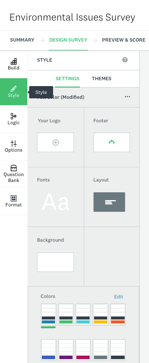
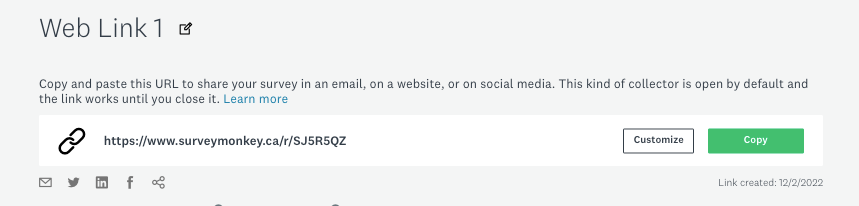
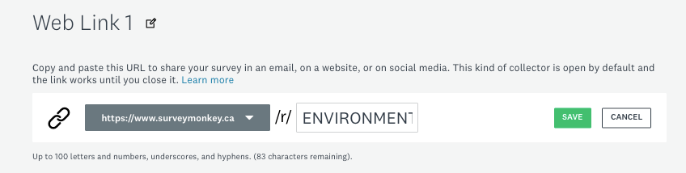

# Activity 2 - Survey Format

1. Now that our questions are complete we can format our survey. It is a great time to use our creativity and think strategically about having a survey that engages the audience beyond the survey questions. We can add color to the survey, add a logo, a footer, the layout, fronts, and we can also choose different themes for the survey.  Click on the icon **STYLE** on the left column and modify the style of your survey by adding colors, changing the font, adding a image as a logo from your choosing and so on.
    
2.	Choosing the FORMAT of your survey. This means that you can set how the questions will show up to the audience: 1) as a classic survey all in a page, 2) One question at time; 3) As a conversation (similar to a digital chat). Select **One Question at a Time**, this is a great way to get people worry-free about the length of the survey. 
    
    - Next to the option “ONE QUESTION AT A TIME” you can click on the **arrow >** and customize the button to pass from one question to another. You can, for instance, replace “OK” by typing in, “NEXT QUESTION”, “NEXT”, etc. 

    
    
     
3.	Now let’s go to the top ribbon and explore the option **PREVIEW & SCORE**. In this section we can have a view of how our survey will look like on different types of screens using **DEVICE VIEW**.  
    - SurveyMonkey automatically shows you the estimated completion rate of the process of your survey so far, the estimated time for someone to complete it, and any recommendations that the system may have. 

     
    
     

    - **_TIP: THIS IS ALSO A GREAT MOMENT TO DOUBLE CHECK THE SURVEY TO MAKE SURE IT IS AS GOOD AS YOU WOULD LIKE._**

4.	On the top right of the page click **NEXT** and you can see some options to collect your response. Next choose to **Send surveys your way**.

     

    

5.	The following image will pop up, and you have many options to spread your survey out. Take a moment on the option, and once you. Have read them out, choose **Share a survey link**.
     
     

6.	A page with a link should be titled, “Web Link 1”. Copy your survey link and if this was a research project you'd send that link to invite people to participate in you survey! 

     
    
    - To customize the survey link to better reflect your survey or research, simply click on the  **Customize** button on the right side of your web link and change the name after the /. Then click on **SAVE**. I for example, chose to call my survey ENVIRONMENTSURVEY.

     

7.	Now we are all set up to collect answers, copy the link and share with five people in this workshop, and make sure to also respond the survey link that your colleagues will send to you. Please be aware that anyone with your survey link will be able to answer it. 

    - This step will take 2-3 minutes. **Below you can see my link, but you need to copy your own weblink.** Feel free to respond it as well.

    [https://www.surveymonkey.ca/r/ENVIRONMENTSURVEY](https://www.surveymonkey.ca/r/ENVIRONMENTSURVEY){:target="_blank"}

[NEXT STEP: Analyzing Results](3-analyzing-results.html){: .btn .btn-blue }
