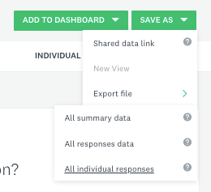
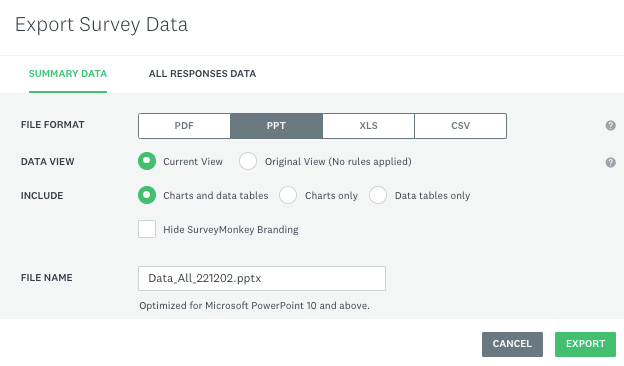

# Activity 3 - Analyzing Survey Results

1.	Now that some people have answered your survey, let’s analyze the results! On the top ribbon, click on **ANALYZE RESULTS**, and you will see unique graphs according to the responses you got. For example:  
     
   
2.	There are several ways to explore the results. In this introductory workshop, we will save all the graphs to our computer, and they will be ready to be used in your presentations, papers, reports, etc. 
    - Click on the **Export** button, then **New export**.
     
    
    - This will open a window where you can choose what you want to export. To save all summaries at once, select "Question summaries" and "PPT". You can also choose if you want just charts or data tables, if you want to hide Survey Monkey branding, and specify the file name. For now, let's keep all tables and figures in the export option. After your selection is done, click on the green **EXPORT** button.
    
    
    - The system will begin to prepare the file to be exported. Once the export is ready, a box will appear at the bottom right. Click **DOWNLOAD** to download the data.
     
    
    - You can create multiple exports, and if you want to download a file again, you can click on "Export" and then "Previous exports", and all your exports will be shown on the left panel.
     
    

    - If you want to download the individual responses so that you can perform additional analysis or create your own images, you can create a new export, but choose "Individual answers" instead of "Question summaries". Saving it as a .csv file with the condensed version will typically be a good option for further use of data, but do explore the other export options if you want.
     
     
<!--- still need to update this animation --->
<!---     <button onclick="toggle('gif1')">Show/Hide Animation</button> --->
<!---     
 --->
<!---      --->
<!---    
 --->

3. You can now **Sign Out** of SurveyMonkey by clicking on your user name on the top right of the page. 

4. The file with the responses have now been downloaded to your computer and you are ready to use your survey results!

## Well done!  You have completed a SurveyMonkey survey and downloaded the results!

 
[NEXT STEPS: Survey Best Practices Tips](reference-sheet.html){: .btn .btn-blue }
