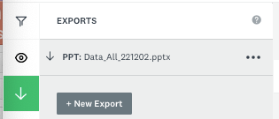

# Activity 3 - Analyzing Survey Results

1.	Now that some people have answered your survey, let’s analyze the results! On the top ribbon click on **ANALYZE RESULTS** and you will see unique graphs according to the responses you got. For example:
   
    
   
2.	There are several ways to explore the results, in this introductory workshop we will save all the graphs to our computer and they will be ready to be used on your presentations, papers, reports, etc. 

     
     

    - Click on the button “SAVE AS” and click in the option “ALL SUMMARY DATA”. The system will begin to prepare the file to be exported. Then, choose PPT and click “EXPORT”.
    - Go to the left pane and click on “EXPORTS”, following that click on the file named PPT: Data+ALL_111111.pptx (the name will change according to the date).
     

3. You can now SIGN OUT of SurveyMonkey by clicking on your credentials on the top right of the page. 

4. The file with the responses have now been downloaded to your computer and you are ready to use your survey results!

# Well done! You have now completed your advanced NVivo Workshop!

[NEXT STEP: Additional Resources](additional-resources.html){: .btn .btn-blue }
