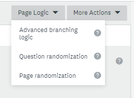
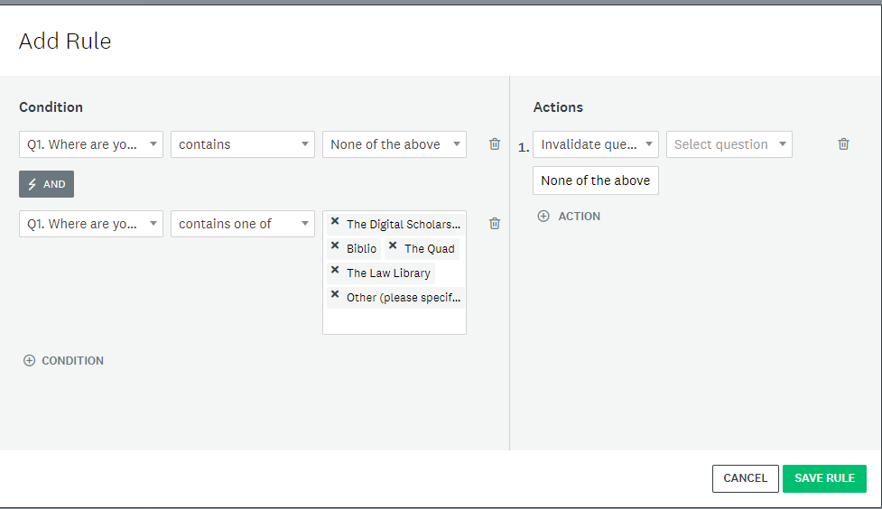

# Optional Activity: Advanced Branching

Watch this [Introduction to Advanced Branching](https://www.youtube.com/watch?v=qOtHfjvqyho)
<iframe width="560" height="315" src="https://www.youtube.com/embed/qOtHfjvqyho" title="YouTube video player" frameborder="0" allow="accelerometer; autoplay; clipboard-write; encrypted-media; gyroscope; picture-in-picture" allowfullscreen></iframe> 

- Visit [Survey Monkey Advanced Branching information](https://help.surveymonkey.com/en/surveymonkey/create/advanced-branching/)  Note the video above is also found within this link. 
- Visit [How to use Advanced Branching](https://help.smapply.io/hc/en-us/articles/115001421914-How-to-use-Advanced-Branching-Logic-to-Dynamically-Change-your-Form) for more information.

1. Start by creating a survey using some questions with Checkboxes.
2. Select **Page Logic** at the top of the page on the right hand side, then select **Advanced branching logic** from the dropdown menu. 

3. Click **New Rule**  

4. Add Conditions by modifying **criteria** and implementing an **action** and **error message**.

- First select the question you wish to include an advanced branch
[Optional: Survey Creation Reference Sheet](reference-sheet.html){: .btn .btn-blue }  or 
[NEXT STEP: Workshop Informal Credential](informal-credentials.html){: .btn .btn-blue }

