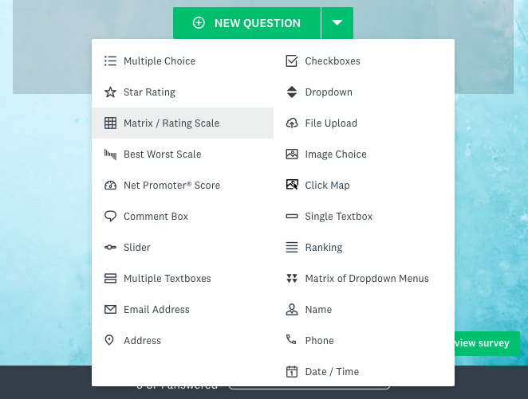
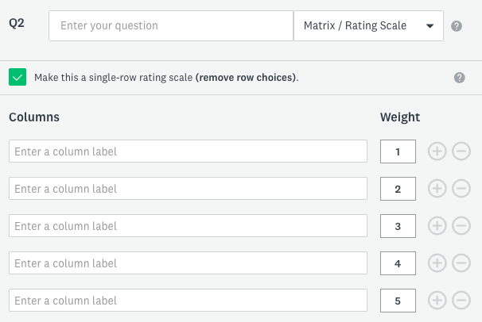
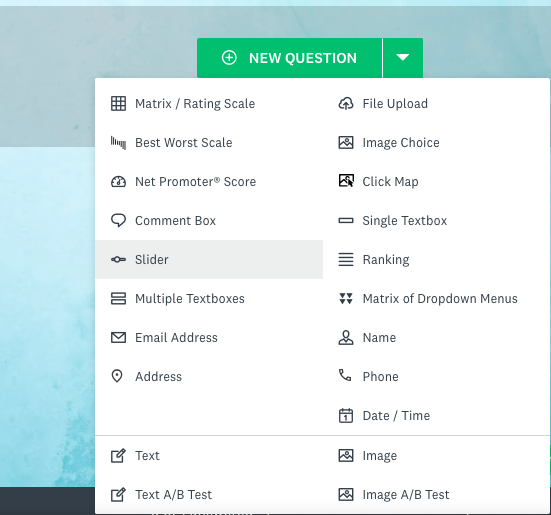
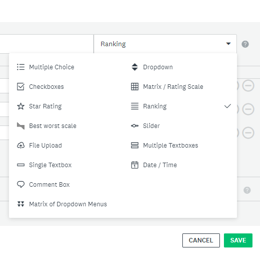
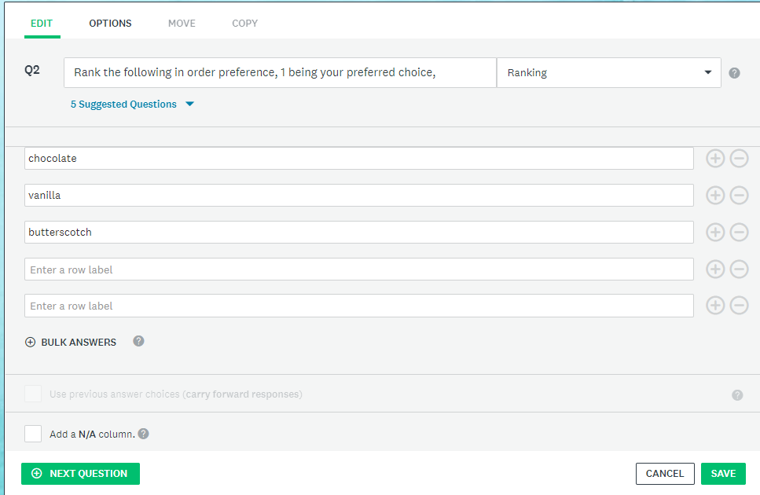

# Optional Activity: Advanced Question Types 

## Matrix Questions
Purpose: To evaluate 1 or more items using the same column options for each row. It is suggested to limit the amount of questions to a maximum of 5 rows or less. This will help insure more validity in responses. 

Watch this [Matrix and Rating Scale questions](https://youtu.be/CHERtQUQadU?si=ueF1w-3WSszxKejK){:target="_blank"}
<iframe width="560" height="315" src="https://www.youtube.com/embed/CHERtQUQadU?si=wlsQNAxZc1sPth9i" title="YouTube video player" frameborder="0" allow="accelerometer; autoplay; clipboard-write; encrypted-media; gyroscope; picture-in-picture; web-share" allowfullscreen></iframe> 

1. First select the green **New Question button**, then click **Matrix/Rating Scale** (see screenshot). 

2. Now enter **a question**. For example you could enter the following question: "how satisfied or disatisfied were you with each of the following statements?" 
3. In the **rows** you can add your options. For example "The DSC Survey Monkey workshop activities, the videos included in the workshop, the beginner activities".
4. In the **columns options**: You can use the following options: " Very satified, Satified, Neither satified or disatisfied, disatified, very disatified."
5. To turn this into a weighted question select **use Weights** 
 
 If not all respondents can repond select **NA**. Also if your row questions are lengthy, select **options**, **adjust question layout** and then change **label width**. Under the options tab you may also make the question mandatory by selecting **require an answer to this question**

## Single Row Rating
1. Following the same steps of a matrix question, you do not have step 3 of adding rows as there will only be the main question and a rating scale. To do this select **"Make this a single-row rating scale (remove row choices)."**. (see screenshot below) 
 

## Slider Questions 
To add a Slider Question watch this [Slider Question video](https://www.youtube.com/watch?v=hHHVdg_S-TI){:target="_blank"}
<iframe width="560" height="315" src="https://www.youtube.com/embed/hHHVdg_S-TI?si=KDZDVTkVuZcj0SRa" title="YouTube video player" frameborder="0" allow="accelerometer; autoplay; clipboard-write; encrypted-media; gyroscope; picture-in-picture; web-share" allowfullscreen></iframe> 

1. First select the green **New Question button**, then click **Slider** (see screenshot). 
 

## Ranking Questions
1. First select the green **New Question button**, then click **Ranking** (see screenshot) 
 
2. Next ask a question regarding preference, for example: Rank the following in order preference, 1 being your preferred choice and 5 being least preferred.
3. Add in the examples you wish respondents to rank, example flavours of ice cream (chocolate, vanilla, butterscotch etc). See scrennshot for an example. 
 

[Optional:Custom Variables and Embedded Data](custom-variables.html){: .btn .btn-blue}  
or [Optional: Survey Creation Reference Sheet](reference-sheet.html){: .btn .btn-blue}  
