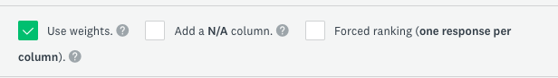

# Optional Activity: Advanced Question Types 
**In order to access this feature you must be logged into you UVic account (log in with SSO)**

## Matrix Questions
Purpose: To evaluate 1 or more items using the same column options for each row. It is suggested to limit the amount of questions to a maximum of 5 rows or less. This will help insure more validity in responses. 

Watch this [Matrix and Rating Scale questions](https://youtu.be/CHERtQUQadU?si=ueF1w-3WSszxKejK){:target="_blank"} (3 min)
<iframe width="560" height="315" src="https://www.youtube.com/embed/CHERtQUQadU?si=wlsQNAxZc1sPth9i" title="YouTube video player" frameborder="0" allow="accelerometer; autoplay; clipboard-write; encrypted-media; gyroscope; picture-in-picture; web-share" allowfullscreen></iframe> 

1. Using the survey created in the Introductory Activities as an example, click on the green "+" button between questions, and then select "Question"
       
3. On the right side of the question, select **Matrix/Rating Scale** instead of "Multiple Choice" (see screenshot).
      
5. Now enter **a question**. For example, you could enter the following question: "How satisfied or dissatisfied were you with each of the following items?" 
6. In the **rows** you can add your options. For example, "The DSC Survey Monkey workshop activities, the videos included in the workshop, the beginner activities".
7. In the **columns options**: You can use the following options: " Very satisfied, Satisfied, Neither satisfied or dissatisfied, dissatisfied, very dissatisfied."
8. To turn this into a weighted question select **use Weights** 
 
 If not all respondents can respond select **NA**. Also if your row questions are lengthy, select **options**, **adjust question layout** and then change **label width**. Under the options tab you may also make the question mandatory by selecting **require an answer to this question**

## Single Row Rating
1. Follow the same steps of a matrix question; but then you do not need to add rows, as there will only be the main question and a rating scale. To do this, select **"Make this a single-row rating scale (remove row choices)."**. (see screenshot below) 
 

## Slider Questions 
To add a Slider Question watch this [Slider Question video](https://www.youtube.com/watch?v=hHHVdg_S-TI){:target="_blank"} (2 min)
<iframe width="560" height="315" src="https://www.youtube.com/embed/hHHVdg_S-TI?si=KDZDVTkVuZcj0SRa" title="YouTube video player" frameborder="0" allow="accelerometer; autoplay; clipboard-write; encrypted-media; gyroscope; picture-in-picture; web-share" allowfullscreen></iframe> 

## Ranking Questions
1. Using the survey created in the Introductory Activities as an example, click on the green "+" button between questions, and then select "Question"
2. On the right side of the question, select **Ranking** instead of "Multiple Choice"
3. 3. Next, ask a question regarding preference, for example: Rank the following ice cream flavours in order preference, 1 being your preferred choice and 5 being least preferred.
4. Add in the examples you wish respondents to rank, for example: chocolate, strawberry, vanilla, etc. See screenshot for an example. 
 

[OPTIONAL:Custom Variables and Embedded Data](custom-variables.html){: .btn .btn-blue}  
