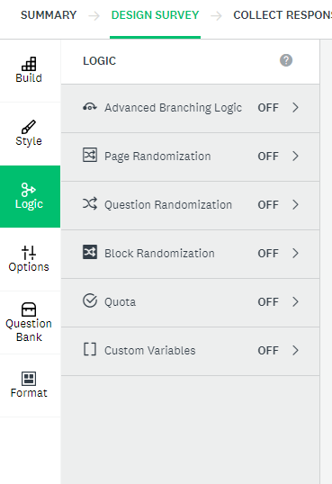
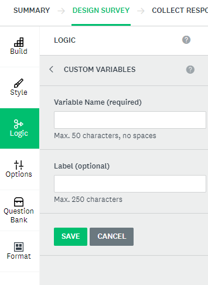

# Optional Activity: Custom Variables and Embedded Data
This video will help you learn how to set up custom variables in SurveyMonkey
<iframe width="560" height="315" src="https://www.youtube.com/embed/6_Au_aO4T00?si=nirHtwU6CUGuvoJN" title="YouTube video player" frameborder="0" allow="accelerometer; autoplay; clipboard-write; encrypted-media; gyroscope; picture-in-picture; web-share" allowfullscreen></iframe>

Custom Variables are used to track data about people who complete your survey. In order to access this feauture you must be logged into you UVic account (log in with SSO)
1. Select **Design Survey** and then click **logic**
2. Click **custom variables** and add new by selecting **+ New custom variable** (see screenshot) 
 
3. To set up a variable, you must add a variable name (which will go in the Web Link)
4. Adding a label is optional but will show in your survey results and will help you during analysis in order to track your variables.
 

[NEXT STEP: Workshop Informal Credential](informal-credentials.html){: .btn .btn-blue }
