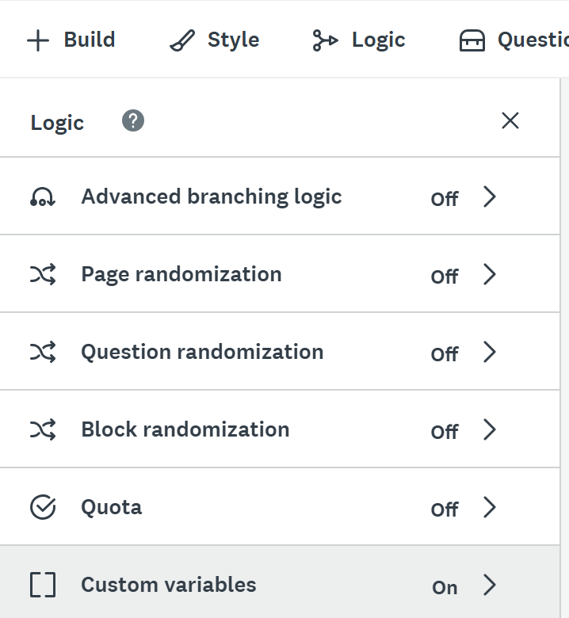
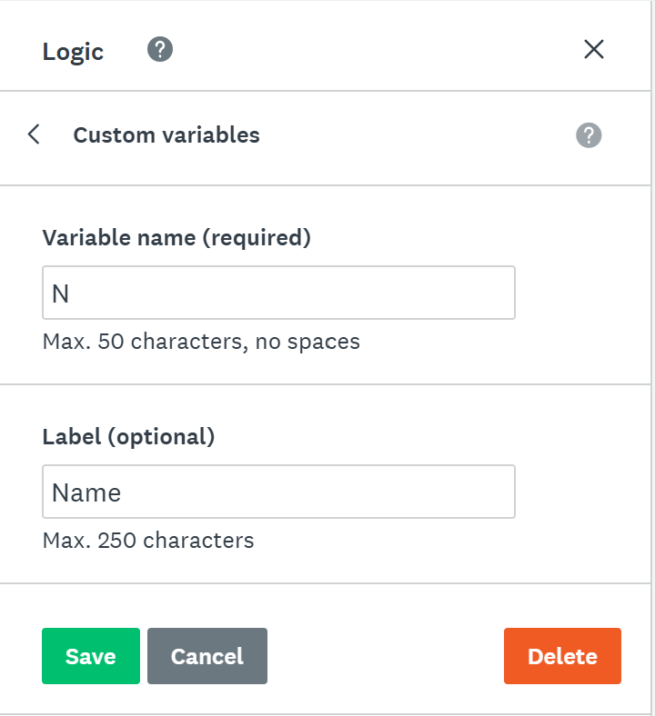

# Optional Activity: Custom Variables and Embedded Data

**In order to access this feature you must be logged into you UVic account (log in with SSO)**

Custom Variables are used to track data about people who complete your survey. With Custom Variables, you can add specific information about your respondents to the link you send, and this information is then passed into your survey results without requiring your respondents to enter it.

This video will help you learn how to set up custom variables in SurveyMonkey (3 min)
<iframe width="560" height="315" src="https://www.youtube.com/embed/6_Au_aO4T00?si=nirHtwU6CUGuvoJN" title="YouTube video player" frameborder="0" allow="accelerometer; autoplay; clipboard-write; encrypted-media; gyroscope; picture-in-picture; web-share" allowfullscreen></iframe>

## To set up custom variables:
1. Select **Design Survey** and then click **logic**
2. Click **custom variables** and add new by selecting **+ New custom variable** (see screenshot) 
 
3. To set up a variable, you must add a variable name (which will go in the Web Link)
4. Adding a label is optional but will show in your survey results and will help you during analysis in order to track your variables. 
 
5. Click Save.

## Adding them to Web Link
1. Under **collect responses**
2. If you already have the weblink set up, it will already be updated. If not, click **Share a survey link**
4. Copy the survey link.
5. Before sharing it with your respondents, add the values for the custom variables you want. For example, if you created a custom variable for Name with N as the variable name, as in the screenshot above, the link will be: https://www.surveymonkey.ca/r/dsc-environmentsurvey?N=[N_value]. You should then substitute the "[N_value}" for the respondent's name. When you share this link, the respondent's name will appear in the results.
6. Careful, custom variable names are case sensitive!
7. This process will create a personalized link for each respondent. Currently, there is no way to automate this process within Survey Money, but you could create your own code somewhere to automate the personalized link creation.
8. More information about custom variables can be found [here](https://help.surveymonkey.com/en/surveymonkey/send/custom-variables/).

# Advanced Logic Options
In order to eliminate bias and improve your survey, you may also think about using Question Randomization, Block Randomization and Page Randomization.
To do this, you also use the options under the **Logic** tab.

The video below details how to use page and question randomization (2 min)

<iframe width="560" height="315" src="https://www.youtube.com/embed/gupVoIX4U_g?si=br1qiuDb505xGLrf" title="YouTube video player" frameborder="0" allow="accelerometer; autoplay; clipboard-write; encrypted-media; gyroscope; picture-in-picture; web-share" referrerpolicy="strict-origin-when-cross-origin" allowfullscreen></iframe>

For more information about these techniques, visit [these survey tips](https://www.surveymonkey.com/curiosity/eliminate-order-bias-to-improve-your-survey-responses/){:target="_blank"}

[OPTIONAL: Additional Resources](additional-resources.html){: .btn .btn-blue } 
[NEXT STEP: Workshop Informal Credential](informal-credentials.html){: .btn .btn-blue }
