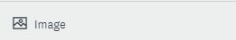
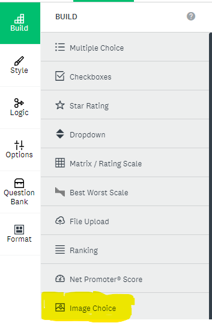
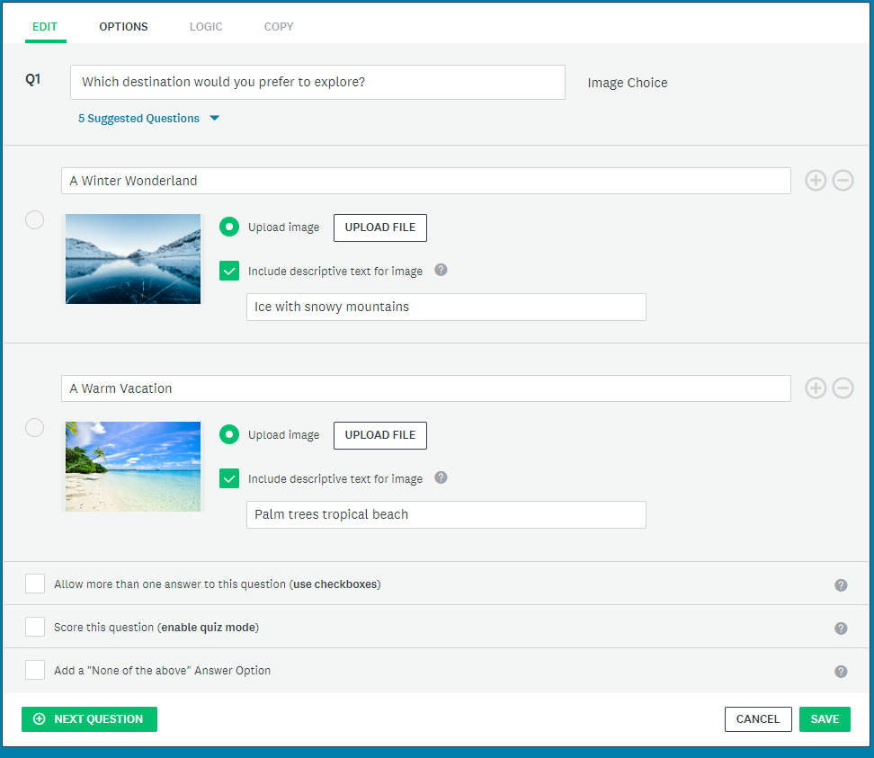
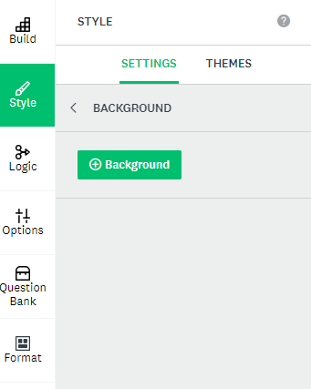
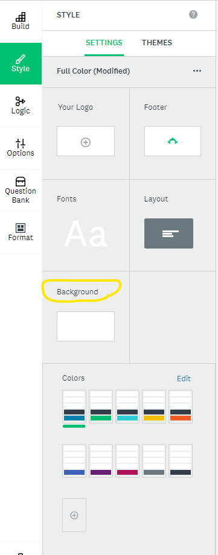

# Optional Activity: Adding Images
**Royalty-Free Photos you can use in your Survey:**
- [Unsplash](https://unsplash.com/){:target="_blank"}
- [Pexels](https://www.pexels.com/){:target="_blank"}
- [Pixabay](https://pixabay.com/){:target="_blank"}

[Adding Images using Survey Monkey](https://help.surveymonkey.com/en/surveymonkey/create/adding-images/){:target="_blank"}

There are multiple different uses for images in Survey Monkey:
- You can add independent images that are seperate from survey questions (A)
- You can add Images onto your multiple choice or checkbox style questions (B)
- You can make a custom theme and add a background image (C)
- You can create Image A/B Tests (D)

## Adding Independent Images: Option A
1. 1. Select **Build** and under the drop down select **image**   
2. Write your question and add images to each response by clicking **Upload file** and dragging and dropping a file. 
3. You may also check the box "include descriptive text for image", if you wish. If you do not select this and include description no text will be visible.

## Adding Images using Image Choice: Option B
1. Select **Build** and under the drop down select **image choice**   
2. Write your question and add images to each response by clicking **Upload file**.
3. You may also check the box "include descriptive text for image", if you wish. If you do not select this and include description no text will be visible.
4. You may also make this question into a checkbox answer by clicking the box that says **Allow more than one answer to this question.**

## Background Image: Option C
1. Select **Style** on the the left side bar.
2. Under style, select **Settings**
3. Then select **Background** by clicking the plain white image.
4. Next click the green **+ background button** 
5. YOu can choose to add an image from the image gallery or toggle to computer and upload your own by drag and dropping the file.
6. You can modify the background opacity as well once you have added your image by moving the toggle side to side. 

Important tip: Images larger than 600px may be cut off. Make sure to view the preview of all devices in Survey Monkey

## Creating Image A/B Tests:
1. Select **Build** and from the drop down select **Image A/B Test**, you can similarly do this for A/B Text as well
2. Then add your images by clicking **uploading file**.

[Optional: Survey Creation Reference Sheet](reference-sheet.html){: .btn .btn-blue 
