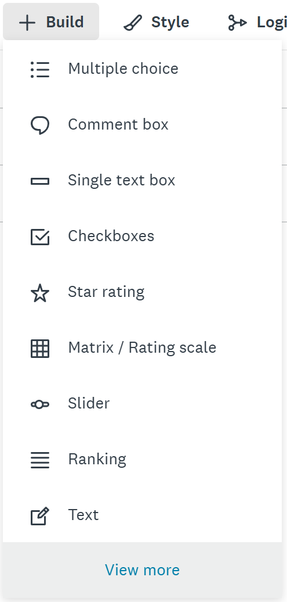
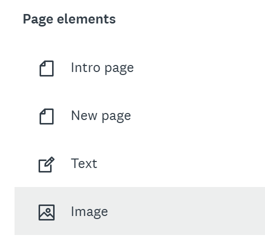
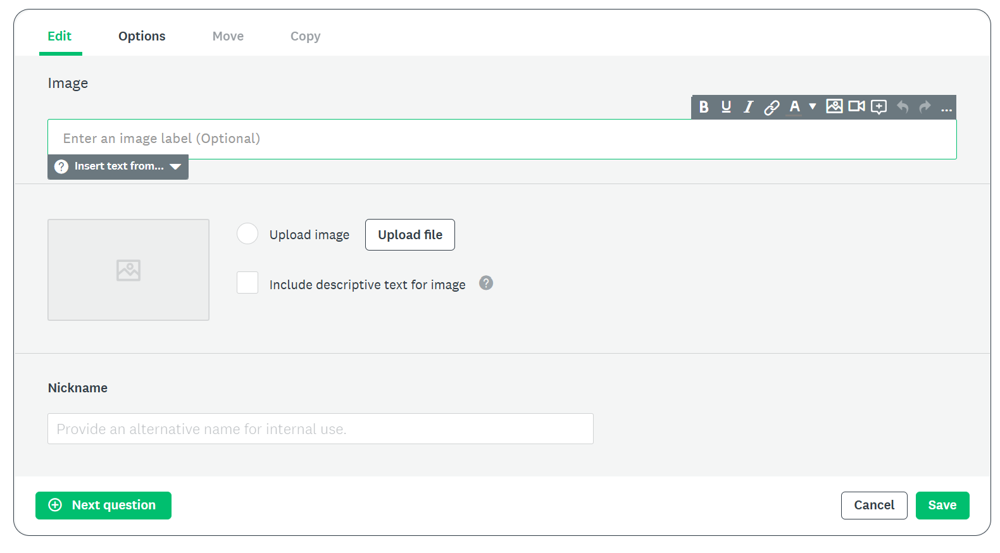
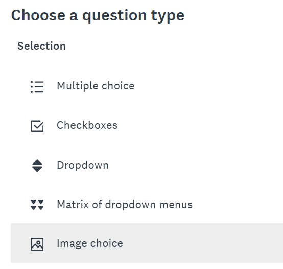
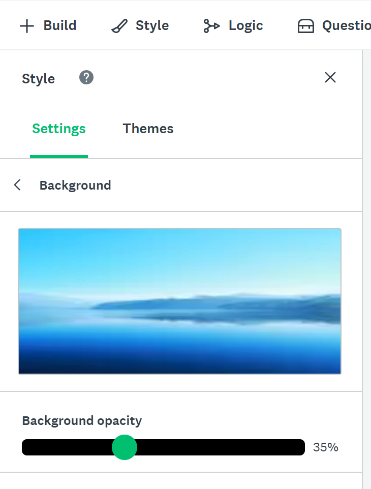

# Optional Activity: Adding Images
**In order to access this feature you must be logged into you UVic account (log in with SSO)**

There are multiple uses for images in Survey Monkey:
- You can add independent images that are separate from survey questions (A)
- You can add images to your multiple-choice or checkbox-style questions (B)
- You can make a custom theme and add a background image (C)
- You can create image A/B Tests (D)

We will look into how to do each fo these options seprately.

## Adding Independent Images (Option A)
1. Select **Build** on the top left, and under the drop-down select "view more".
    
   
5. Scroll down to Page Elements, and select "Image"
    
   
7. A box will appear where you can upload an image from your computer.
    
    
8. You can add an image label and include a descriptive text for your image if you want.
9. Click "Save".
10. You can then drag your image to place it where you want in your survey.

## Adding Images using Image Choice (Option B)
1. Select **Build**, then "View more", and under the heading **Selection** select **Image choice**
    
    
3. Write your question and add images to each response by clicking **Upload file**.
    
    
5. You may also check the box "include descriptive text for image", if you wish. If you do not select this and include a description, no text will be visible.
6. You may also make this question into a checkbox answer by clicking the box that says **Allow more than one answer to this question.**

## Background Image (Option C)
1. Select **Style** on the the left side bar.
2. Under style, select **Settings**
3. Then select **Background** by clicking the plain white image.
4. Next click the green **+ background button** 
5. You can choose to add an image from the image gallery or toggle to computer and upload your own by dragging and dropping the file.
6. You can modify the background opacity as well once you have added your image by clicking in the Background button under Style > Settings, and then moving the toggle side to side. 

Important tip: Images larger than 600px may be cut off. Make sure to view the preview of all devices in Survey Monkey

## Creating Image A/B Tests (Option D)
The A/B Image option allows you to display different images for different sets of respondents. This might be useful if you are interested in understanding how the images affect the responses, for example.
1. Select **Build**, **View More**, and under heading **Other***,  select **Image A/B Test**, you can similarly do this for A/B Text as well
2. Then add your images by clicking **uploading file**. You can add up to 20 images.
3. Next to the image, choose the % of respondents that will be shown each image.
   
More information about **A/B Tests** (Random Assignment) can be found at this [site](https://help.surveymonkey.com/en/surveymonkey/create/ab-tests/){:target="_blank"}

## Final notes 
- There are other ways to add images in Survey Monkey as well. For instance, you can also add a logo by clicking **+ Logo** at the top of the survey page.
- Here are some suggestios of websites do obtain Royalty-Free Photos you can use in your Survey:
  - [Unsplash](https://unsplash.com/){:target="_blank"}
  - [Pexels](https://www.pexels.com/){:target="_blank"}
  - [Pixabay](https://pixabay.com/){:target="_blank"}
- For more information about adding images to your survey, check out this link: [Adding Images using Survey Monkey](https://help.surveymonkey.com/en/surveymonkey/create/adding-images/){:target="_blank"}

[Optional: Adding Audio](audio.html){: .btn .btn-blue} 
