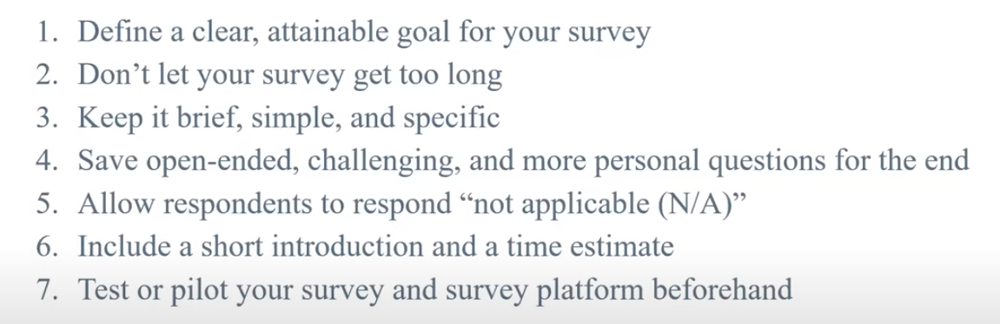

# Survey Best Practices Tips  

To learn more visit [best practices for survey creation](https://www.surveymonkey.com/mp/survey-guidelines/) 

## Some useful videos outlining useful survey design tips
- Visit [Designing a Survey](https://www.youtube.com/watch?v=mdVWbuffdNY) (5 minute video)
- **OPTIONAL**: Visit [Creating Effective Surveys](https://www.youtube.com/watch?v=6H3AI0M6ZOk) (22 minute video)

According to Institute of Education Science video, the General Best Practices are the following

## Additional resources for best practices 
Resources published by [Louisiana State University](https://grok.lsu.edu/article.aspx?articleid=17958) and [Qualtrics](https://www.qualtrics.com/blog/how-to-create-a-survey/) have been summarized below:

**Language**
-	Ask one question at a time instead of double-barreled questions that often contain the word “and.” A survey question should contain only a single concept.
-	Avoid jargon, acronyms, technical terms, and obscure phrases. Use simple words and specific language to create questions that yield precise answers.
-	Avoid leading and loaded questions (e.g., “Do you agree that…).
-	Avoid using indefinite qualifiers (e.g., only, just, merely, many, few, or seldom).

**Question format**
-	A 5-point [Likert scale](https://www.surveymonkey.com/mp/likert-scale/) is recommended. The 'distance' between the values should be as 'equal' as possible. For example, responses to a question such as “How helpful was the content presented at the workshop?” could comprise 1. Extremely helpful 2. Very helpful 3. Somewhat helpful 4. Not so helpful 5. not at all helpful” 
-	Use matrix questions at your sparingly. These questions comprise a series of questions with the same set of answers on the same page. While this can be more efficient for respondents, it can potentially cause confusion.
-	For “Check all that apply” and “Select up to three responses” questions, keep the list from getting too long (e.g., a maximum of 10 answers). If there is a “does not apply” answer, this should be listed first.
-	Avoid forced-choice questions. Use options such as “don’t know” and “not applicable” sparingly, otherwise it gives respondents an easy way to skip past a question.

[NEXT STEP: Workshop Informal Credential](informal-credentials.html){: .btn .btn-blue }
